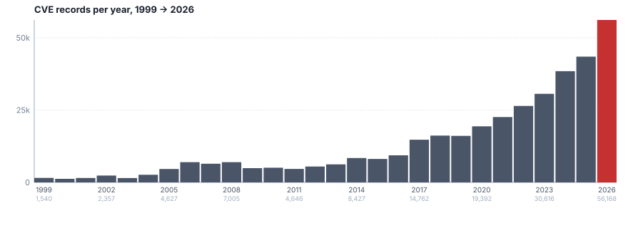

# CVE Insights for AI Builders

<!-- cve-data-as-of:START -->
**Data as of: 2026-09-13** _(refreshed daily from upstream cvelistV5 — pull this page tomorrow and the rankings will have moved)._
<!-- cve-data-as-of:END -->

> 🌐 **中文版：[README.cn.md](./README.cn.md)** —— same data, Chinese CWE names (MITRE 官方中文翻译, ~91% 覆盖；缺失自动回退英文).
>
> - **[The 10 newest CVEs](#the-10-newest-cves)** — what landed in your stack this week.
> - **[What CVEs keep teaching us](#what-cves-keep-teaching-us)** — top weakness classes since 2024; the same names show up again and again.
> - **[How fast is CVE growing?](#how-fast-is-cve-growing)** — 2026 is on track for ~75k, double 2024's 38k; is your scanner keeping up?
> - **[Reports](#reports)** — the raw TSVs behind the tables above (free, no API key).
> - **[About x-cmd/cve](#about-xcmdcve)** — this repo is the producer, `x cve` is the consumer.
> - **[FAQ](#faq)** — the questions people actually ask.
>
> For end users: [`SKILL.md`](./SKILL.md) (raw TSV recipes). For developers: [`CONTRIBUTING.md`](./CONTRIBUTING.md) (pipeline).

## The 10 newest CVEs

The 10 newest CVEs published to MITRE — these are the freshest
records on the index. If any of the products below are in your
dependency tree (almost certainly), click through to the NVD page
and check the affected-version range against your pinned versions.


<!-- BEGIN cve.latest-10.report.md -->

**The 10 newest CVEs** (descending CVE id = newest published first).

| CVE | Score | Product | CWE | Description |
| --- | ---:  | ---     | :-: | ---         |
| [CVE-2026-90783](https://nvd.nist.gov/vuln/detail/CVE-2026-90783) | 8.5 | Moritz Bunkus/MKVToolNix | [680](https://cwe.mitre.org/data/definitions/680.html) | MKVToolNix through 101.0 contains a heap buffer overflow in the bundled avilib… |
| [CVE-2026-90782](https://nvd.nist.gov/vuln/detail/CVE-2026-90782) | 6.0 | Systerel/S2OPC | [476](https://cwe.mitre.org/data/definitions/476.html) | S2OPC through 1.7.3 contains a null pointer dereference in… |
| [CVE-2026-90781](https://nvd.nist.gov/vuln/detail/CVE-2026-90781) | 4.8 | ALSA Project/alsa-lib | [193](https://cwe.mitre.org/data/definitions/193.html) | alsa-lib through 1.2.16.1 contains a stack buffer overflow in the… |
| [CVE-2026-90780](https://nvd.nist.gov/vuln/detail/CVE-2026-90780) | 8.7 | SIPp/sipp | [120](https://cwe.mitre.org/data/definitions/120.html) | SIPp through 3.7.7 contains a buffer overflow vulnerability in the get_header()… |
| [CVE-2026-90779](https://nvd.nist.gov/vuln/detail/CVE-2026-90779) | 8.7 | SIPp/sipp | [121](https://cwe.mitre.org/data/definitions/121.html) | SIPp through 3.7.7 contains a stack buffer overflow vulnerability in… |
| [CVE-2026-90778](https://nvd.nist.gov/vuln/detail/CVE-2026-90778) | 8.7 | SIPp/sipp | [120](https://cwe.mitre.org/data/definitions/120.html) | SIPp through 3.7.7 contains a buffer overflow vulnerability in get_peer_tag()… |
| [CVE-2026-90777](https://nvd.nist.gov/vuln/detail/CVE-2026-90777) | 8.8 | espnet/espnet | [502](https://cwe.mitre.org/data/definitions/502.html) | ESPnet before 202609 deserializes pretrained model checkpoints using torch.load… |
| [CVE-2026-90776](https://nvd.nist.gov/vuln/detail/CVE-2026-90776) | 8.7 | nodemailer/nodemailer | [407](https://cwe.mitre.org/data/definitions/407.html) | Nodemailer versions 9.1.0 through 10.0.4 contain a quadratic time complexity… |
| [CVE-2026-90775](https://nvd.nist.gov/vuln/detail/CVE-2026-90775) | 7.1 | PostGIS/address_standardizer | [125](https://cwe.mitre.org/data/definitions/125.html) | PostGIS address_standardizer through 3.7.0 fails to validate the Weight… |
| [CVE-2026-90774](https://nvd.nist.gov/vuln/detail/CVE-2026-90774) | 8.7 | orhun/rustypaste | [22](https://cwe.mitre.org/data/definitions/22.html) | rustypaste before 0.18.1 validates the destination path before applying the… |

_Click a CVE id for the full record on NVD._
<!-- END cve.latest-10.report.md -->

## What CVEs keep teaching us

> The table below is regenerated on every CI run from
> [`report/cwe.top100.by-cve-count.since-2024.report.tsv`](./report/cwe.top100.by-cve-count.since-2024.report.tsv).
> Since 2024, XSS, SQL Injection, and Missing Authorization have
> been the top three weakness classes — every year, with very
> little reshuffling below. If your AI app renders user-supplied
> content or talks to a SQL backend, you're one unescaped
> interpolation away from shipping these.

<!-- BEGIN cwe.report.md -->

_117,604 CVEs across 683 distinct CWEs since 2024._

### What mistake do engineers keep making most often since 2024?

_Top 10 CWE by CVE count._

| Rank | CWE | Name | CVEs | Avg score |
| ---: | :-: | :--- | ---: | ---:      |
| 1 | [79](https://cwe.mitre.org/data/definitions/79.html) | Improper Neutralization of Input During Web Page Generation ('Cross-site Scripting') | 17,210 | 6.17 |
| 2 | [89](https://cwe.mitre.org/data/definitions/89.html) | Improper Neutralization of Special Elements used in an SQL Command ('SQL Injection') | 7,738 | 7.46 |
| 3 | [862](https://cwe.mitre.org/data/definitions/862.html) | Missing Authorization | 6,338 | 5.97 |
| 4 | [74](https://cwe.mitre.org/data/definitions/74.html) | Improper Neutralization of Special Elements in Output Used by a Downstream Component ('Injection') | 4,302 | 7.02 |
| 5 | [22](https://cwe.mitre.org/data/definitions/22.html) | Improper Limitation of a Pathname to a Restricted Directory ('Path Traversal') | 3,323 | 7.18 |
| 6 | [352](https://cwe.mitre.org/data/definitions/352.html) | Cross-Site Request Forgery (CSRF) | 3,276 | 5.81 |
| 7 | [94](https://cwe.mitre.org/data/definitions/94.html) | Improper Control of Generation of Code ('Code Injection') | 2,796 | 6.79 |
| 8 | [416](https://cwe.mitre.org/data/definitions/416.html) | Use After Free | 2,570 | 7.67 |
| 9 | [78](https://cwe.mitre.org/data/definitions/78.html) | Improper Neutralization of Special Elements used in an OS Command ('OS Command Injection') | 2,533 | 8.10 |
| 10 | [125](https://cwe.mitre.org/data/definitions/125.html) | Out-of-bounds Read | 2,321 | 6.34 |

### When that mistake is made, how bad is it since 2024?

_Top 10 CWE by average CVSS score. Min 10 CVEs to suppress single-CWE outliers._

| Rank | CWE | Name | CVEs | Avg score | Max |
| ---: | :-: | :--- | ---: | ---:      | ---: |
| 1 | [506](https://cwe.mitre.org/data/definitions/506.html) | Embedded Malicious Code | 48 | 9.15 | 10.0 |
| 2 | [95](https://cwe.mitre.org/data/definitions/95.html) | Improper Neutralization of Directives in Dynamically Evaluated Code ('Eval Injection') | 136 | 8.56 | 10.0 |
| 3 | [565](https://cwe.mitre.org/data/definitions/565.html) | Reliance on Cookies without Validation and Integrity Checking | 18 | 8.38 | 9.8 |
| 4 | [502](https://cwe.mitre.org/data/definitions/502.html) | Deserialization of Untrusted Data | 1,749 | 8.34 | 10.0 |
| 5 | [288](https://cwe.mitre.org/data/definitions/288.html) | Authentication Bypass Using an Alternate Path or Channel | 465 | 8.27 | 10.0 |
| 6 | [917](https://cwe.mitre.org/data/definitions/917.html) | Improper Neutralization of Special Elements used in an Expression Language Statement ('Expression Language Injection') | 29 | 8.21 | 10.0 |
| 7 | [29](https://cwe.mitre.org/data/definitions/29.html) | Path Traversal: '..filename' | 49 | 8.16 | 9.9 |
| 8 | [120](https://cwe.mitre.org/data/definitions/120.html) | Buffer Copy without Checking Size of Input ('Classic Buffer Overflow') | 1,120 | 8.12 | 10.0 |
| 9 | [306](https://cwe.mitre.org/data/definitions/306.html) | Missing Authentication for Critical Function | 1,276 | 8.12 | 10.0 |
| 10 | [121](https://cwe.mitre.org/data/definitions/121.html) | Stack-based Buffer Overflow | 1,836 | 8.12 | 10.0 |
<!-- END cwe.report.md -->

<!-- BEGIN cve.report.md -->


## How fast is CVE growing?
> 2026 is on track for ~75,000 CVEs — double 2024's 38,451 in
> just two years. If your scanning cadence is annual, you're
> 6-12 months behind the most recent year. Source:
> [`report/cve.report.tsv`](./report/cve.report.tsv).



<details>
<summary><strong>CVSS scoring went mainstream around 2021.</strong> Click for the breakdown by year.</summary>

| Year | Scored % |
|---|---|
| 2017 | 9.3% |
| 2019 | 21.9% |
| 2020 | 35.7% |
| **2021** | **47.9%** — first year the scored share approaches half |
| 2022 | 66.1% — crosses the halfway line |
| 2023 | 80.8% |
| 2024+ | 96%+ |

For most of CVE's first two decades, the majority of records
**had no CVSS vector at all** in the upstream JSON — the
`containers.cna.metrics[]` field was simply absent, not "v1
that we lost". CNAs weren't required to publish one and most
didn't bother. CVSS v2.0 became the standard in 2007, but
adoption was slow — sampling shows under 10% scored until ~2018.
Around **2021–2022** the share crosses 50% as CVSS v3.0/v3.1
became the default expectation across the bigger CNAs and
NVD's triage started deprioritizing un-scored records. By 2024
the share is 96%+ and basically universal.

</details>

<details>
<summary><strong>How is the per-year table built?</strong> Click for methodology.</summary>

The table below is regenerated on every CI run from
`report/cve.report.tsv`. It includes every year from 1999 to
today, with a **Total** row at the bottom. The columns are:
**CVEs** (count of records), **Scored** (count with at least
one published CVSS vector), **Avg score** (mean CVSS base across
scored ones), **Max score** (highest CVSS seen in the year).
For a deeper explanation of the scoring inflection see the
fold above.

</details>
| Year | CVEs | Scored | Avg score | Max score |
| ---: | ---: | ---:   | ---:      | ---:      |
| 2026 _(YTD as of 2026-09-13)_ | 56,227 | 53,284 | 7.09 | 10.0 |
| 2025 | 43,471 | 42,044 | 6.79 | 10.0 |
| 2024 | 38,451 | 37,057 | 6.81 | 10.0 |
| 2023 | 30,616 | 24,751 | 6.73 | 10.0 |
| 2022 | 26,445 | 17,468 | 6.79 | 10.0 |
| 2021 | 22,601 | 10,834 | 6.83 | 10.0 |
| 2020 | 19,392 | 6,916 | 6.84 | 10.0 |
| 2019 | 16,096 | 3,527 | 6.84 | 10.0 |
| 2018 | 16,188 | 2,292 | 6.92 | 10.0 |
| 2017 | 14,762 | 1,375 | 7.18 | 10.0 |
| 2016 | 9,367 | 408 | 7.10 | 10.0 |
| 2015 | 8,111 | 252 | 6.26 | 10.0 |
| 2014 | 8,427 | 290 | 6.62 | 10.0 |
| 2013 | 6,221 | 154 | 7.44 | 10.0 |
| 2012 | 5,488 | 147 | 7.82 | 10.0 |
| 2011 | 4,646 | 96 | 7.54 | 10.0 |
| 2010 | 5,074 | 95 | 7.74 | 10.0 |
| 2009 | 4,921 | 65 | 8.01 | 10.0 |
| 2008 | 7,005 | 41 | 7.31 | 9.8 |
| 2007 | 6,458 | 38 | 8.00 | 9.8 |
| 2006 | 6,995 | 42 | 7.94 | 9.8 |
| 2005 | 4,627 | 21 | 6.23 | 9.8 |
| 2004 | 2,644 | 11 | 7.33 | 9.8 |
| 2003 | 1,504 | 6 | 5.73 | 7.5 |
| 2002 | 2,357 | 11 | 7.43 | 9.8 |
| 2001 | 1,537 | 5 | 7.54 | 9.8 |
| 2000 | 1,236 | 0 | — | 0.0 |
| 1999 | 1,540 | 24 | 7.62 | 9.8 |
| **Total** | **372,407** | **201,254** | **6.88** | **10.0** |
<!-- END cve.report.md -->

## Reports

The tables above are sliced from the derived reports in
[`report/`](./report/) (sibling of `data/`) — see
[`report/README.md`](./report/README.md) for methodology, the SINCE_DATE
cutoff, and how the top-10 markdown is sliced from the top-100 TSV.

### Per-year CVE stats

| File | Format | Window |
| ---  | ---    | ---    |
| [`report/cve.report.md`](./report/cve.report.md)   | Markdown table | all years |
| [`report/cve.report.tsv`](./report/cve.report.tsv) | TSV            | all years |

### Latest-N CVEs (front-of-page table)

| File | Format | Window |
| ---  | ---    | ---    |
| [`report/cve.latest-10.report.md`](./report/cve.latest-10.report.md)   | Markdown table | newest 10 CVEs |
| [`report/cve.latest-10.report.tsv`](./report/cve.latest-10.report.tsv) | TSV            | newest 10 CVEs |

### CWE rankings — top 100 TSVs (one per axis × window)

| File | Axis | Window |
| ---  | ---  | ---    |
| [`report/cwe.top100.by-cve-count.report.tsv`](./report/cwe.top100.by-cve-count.report.tsv)               | CVE count  | all years |
| [`report/cwe.top100.by-cve-score.report.tsv`](./report/cwe.top100.by-cve-score.report.tsv)               | avg score  | all years |
| [`report/cwe.top100.by-cve-count.since-2024.report.tsv`](./report/cwe.top100.by-cve-count.since-2024.report.tsv) | CVE count  | since 2024 |
| [`report/cwe.top100.by-cve-score.since-2024.report.tsv`](./report/cwe.top100.by-cve-score.since-2024.report.tsv) | avg score  | since 2024 |

### CWE rankings — markdown (top 10 per axis, since 2024)

| File | Format |
| ---  | ---    |
| [`report/cwe.report.md`](./report/cwe.report.md) | Markdown, two top-10 tables — the top-10 markdown is sliced from the two since-2024 TSVs above |

## About x-cmd/cve

This repo is the **producer**: it reads
[`CVEProject/cvelistV5`](https://github.com/CVEProject/cvelistV5),
extracts a slim 9-column TSV per year, xz-compresses it, and publishes
the artifacts as [GitHub Release assets](https://github.com/x-cmd/cve/releases/tag/data)
(`https://github.com/x-cmd/cve/releases/download/data/<name>.xz`).
The consumer is the [`x cve`](https://x-cmd.com/mod/cve) shell module,
which downloads on demand and never touches the upstream tree at runtime.
Companion module [`x cwe`](https://x-cmd.com/mod/cwe) browses the CWE
catalog.

### How users get CVE data (the 4 commands)

```sh
# 1. Browse — list / fzf over every cached CVE, newest first.
x cve
x cve fz

# 2. Look up a single CVE by id (or YYYY-NNNN shorthand).
x cve info CVE-2024-0001
x cve info 2024-0001            # same thing, no prefix needed

# 3. Pull the FULL upstream JSON record from CVEProject/cvelistV5:
#    affected products, references, timeline, ADP containers, etc.
x cve detail CVE-2024-0001

# 4. Enrich with Shodan's CVE database — EPSS, KEV listing,
#    exploit writeups, vendor advisories aggregated into one record:
x shodan cve CVE-2024-0001
#    (https://x-cmd.com/mod/shodan/cve)
```

`x cve` and `x shodan cve` chain cleanly:

```sh
x cve fz | x shodan cve -      # preview every CVE in shodan
x shodan cve CVE-2024-0001     # equivalent, no pipe needed
```

No API keys, no sudo, no background services — `x cve` is a thin
shell module backed by the per-year TSVs this repo publishes daily.


## Developer docs

Repository layout, schema details, scripts, and CI pipeline live in
[`CONTRIBUTING.md`](./CONTRIBUTING.md).

How to use the data → [`SKILL.md`](./SKILL.md).

## License

Apache License 2.0 — see [`LICENSE`](./LICENSE).

The underlying CVE records are derived from
[CVEProject/cvelistV5](https://github.com/CVEProject/cvelistV5),
which is released under [CC BY 4.0](https://creativecommons.org/licenses/by/4.0/).
Downstream consumers of these TSVs must retain that attribution.

## Related

- [x-cmd/cve module docs](https://x-cmd.com/mod/cve) — consumer (shell)
- [x-cmd/cwe module docs](https://x-cmd.com/mod/cwe) — companion module
- [x-cmd/x-cmd](https://github.com/x-cmd/x-cmd) — module source (`mod/cve/`)
- [CVEProject/cvelistV5](https://github.com/CVEProject/cvelistV5) — upstream data

## FAQ

### What is CVE?

**CVE** (Common Vulnerabilities and Exposures) is the public, free
catalog of every publicly disclosed computer-security vulnerability,
maintained by [MITRE](https://cve.mitre.org/) under funding from
the U.S. Department of Homeland Security. Each entry gets a unique
id (`CVE-YYYY-NNNN`) plus a short English description, a list of
affected vendor/products, a CVSS base score, and the weakness class
([CWE](https://cwe.mitre.org/)) the vuln maps to. As of 2026 the
catalog holds ~370,000 records going back to CVE-1999-0001.

### What is CWE?

**CWE** (Common Weakness Enumeration) is the taxonomy of software
weakness *types* — categories like "Cross-Site Scripting",
"Use After Free", "Path Traversal". A CVE points at one or more
CWE ids in its `problemTypes[]` array; this repo joins the two so
you can ask "how many XSS vulns shipped this year?" without
scanning 370k records by hand. MITRE's full CWE catalog lives at
[`data/cwe.tsv`](./data/cwe.tsv); the slim id→name join table is
[`data/cwe.slim.tsv`](./data/cwe.slim.tsv).

### What is the difference between CVE and CWE?

- **CVE** = a *specific instance* of a bug (e.g. CVE-2026-90616:
  Flatpak before 1.18.1 has a sandbox-escape).
- **CWE** = the *category* of bug (e.g. CWE-22: Path Traversal).

A single CVE typically references one or more CWE ids that
describe the class of weakness. CWE counts across CVEs are how
this repo ranks "which mistakes keep happening most".

### What are the most common CWE weaknesses?

The **Top 10 CWE by CVE count** table at the top of this README
shows what's getting shipped most since 2024. As of this run:

1. [CWE-79](https://cwe.mitre.org/data/definitions/79.html) — Cross-Site Scripting (XSS)
2. [CWE-89](https://cwe.mitre.org/data/definitions/89.html) — SQL Injection
3. [CWE-862](https://cwe.mitre.org/data/definitions/862.html) — Missing Authorization
4. [CWE-22](https://cwe.mitre.org/data/definitions/22.html) — Path Traversal
5. [CWE-94](https://cwe.mitre.org/data/definitions/94.html) — Code Injection
6. [CWE-78](https://cwe.mitre.org/data/definitions/78.html) — OS Command Injection
7. [CWE-416](https://cwe.mitre.org/data/definitions/416.html) — Use After Free
8. [CWE-20](https://cwe.mitre.org/data/definitions/20.html) — Improper Input Validation
9. [CWE-125](https://cwe.mitre.org/data/definitions/125.html) — Out-of-bounds Read
10. [CWE-352](https://cwe.mitre.org/data/definitions/352.html) — CSRF

XSS and SQLi have topped this list every year since CVE started.
For the top-100 (all years and since-2024 windows), see
[`report/cwe.top100.by-cve-count.report.tsv`](./report/cwe.top100.by-cve-count.report.tsv).

### What are the most dangerous (highest CVSS) CWE classes?

The **Top 10 CWE by average CVSS score** table ranks weakness
*types* by the mean CVSS base score of the CVEs that reference
them (with at least 10 samples to suppress single-CVE outliers).
The head of this list tends to be dominated by:

- [CWE-506](https://cwe.mitre.org/data/definitions/506.html) — Embedded Malicious Code
- [CWE-95](https://cwe.mitre.org/data/definitions/95.html) — Eval Injection
- [CWE-502](https://cwe.mitre.org/data/definitions/502.html) — Deserialization of Untrusted Data
- [CWE-288](https://cwe.mitre.org/data/definitions/288.html) — Authentication Bypass via Alternate Channel
- [CWE-121](https://cwe.mitre.org/data/definitions/121.html) — Stack-based Buffer Overflow

These are the classes that, when shipped, *hurt the most*. The
table is regenerated on every CI run — see
[`report/cwe.top100.by-cve-score.report.tsv`](./report/cwe.top100.by-cve-score.report.tsv)
for the full top-100.

### What are the latest published CVEs?

The **10 newest CVEs** table at the very top of this README is
the front-of-page answer. It's regenerated every 4 hours directly
from MITRE's feed, so the table you see is at most a few hours
behind "right now". For the machine-readable top-N, see
[`report/cve.latest-10.report.tsv`](./report/cve.latest-10.report.tsv)
or run `python3 .x-cmd/latest.py N` for any other N.

### How many CVEs are published per year?

The "How fast is CVE growing?" table on this page answers that
question year-by-year with totals, scored count, and average /
max CVSS. The short answer: CVE volume has roughly doubled in
the past five years, with 2026 already past 56,000 records in
the first three quarters. Full per-year TSV lives at
[`report/cve.report.tsv`](./report/cve.report.tsv).

### Why does `cve-2015.tsv` have 8,110 rows but a max CVE id of 1,142,857?

Because MITRE assigned **large reserved id blocks** to the big
CNAs (Microsoft, Apple, Adobe, Google, Oracle) and each CNA
filled only a fraction. Take 2014 as a concrete example
(verified against the upstream `cvelistV5` JSON tree):

| 2014 NNNN range | Rows | Likely owner |
|---|---|---|
| 1 – 9,999 | 8,162 | general / small CNAs |
| 10,000 – 19,999 | 102 | Microsoft (reserved) |
| 20,000 – 99,999 | 0 | (no CNAs filled this range) |
| 100,000 – 109,999 | 39 | Microsoft (mid-range) |
| 120,000 – 125,127 | 123 | Apple (late-2014 block) |

So the 93% gap in 2014 (8,426 rows vs max id 125,128) is mostly
two big blocks reserved for Microsoft and Apple that each got
only 1-2% filled. The 99% gap in 2015 follows the same shape.
Post-2020 the gap settled at 38-53%, the steady-state mix of
smaller reserved blocks + REJECT (withdrawn) records +
duplicate-merge dedup.

This is also why the per-year TSV is sorted by the NNNN
**integer** (not lexicographic) — so `CVE-2026-10000` shows up
where it actually belongs, not buried under the gap. Full
numbers in
[docs/5-yearly-stats-explained.md](./docs/5-yearly-stats-explained.md).

### How do I look up a single CVE?

For one record by id (e.g. `CVE-2024-0001`), the upstream
authority is the [NVD detail page](https://nvd.nist.gov/vuln/detail/CVE-2024-0001)
(NIST). The repo's companion [`x cve`](https://x-cmd.com/mod/cve)
shell module gives you the same answer offline:

```sh
x cve info CVE-2024-0001
x cve info 2024-0001            # YYYY-NNNN shorthand works too
x cve detail CVE-2024-0001      # full upstream JSON
```

`x cve` reads the per-year TSVs in this repo, so it works
air-gapped once the release asset has been fetched.

### How do I download the full CVE database?

Three options, all free and unauthenticated:

```sh
# 1. One specific year (smallest payload, ~5 MB xz)
curl -fsSL https://github.com/x-cmd/cve/releases/download/data/cve-2026.tsv.xz     | xz -dc > cve-2026.tsv

# 2. Whole catalog as a tarball (~21 MB xz)
curl -fsSL https://github.com/x-cmd/cve/releases/download/data/cve-all.tar.xz     | tar -xJ

# 3. Just the CWE catalog (~150 KB xz, ~3 MB raw)
curl -fsSL https://github.com/x-cmd/cve/releases/download/data/cwe.tsv.xz     | xz -dc > cwe.tsv
```

Each asset is regenerated every 4 hours when upstream changes.
Files are plain tab-separated TSVs — see
[TSV columns](#tsv-columns-9) for the schema. No API key,
no rate limit.

### How do I query CVEs by CWE / vendor / CVSS?

The TSV columns are documented under
[TSV columns](#tsv-columns-9). Because everything is plain
text, standard Unix tooling is enough:

```sh
# All XSS CVEs scored >= 7.0 since 2024
xz -dc cve-2024.tsv cve-2025.tsv cve-2026.tsv 2>/dev/null     | awk -F'\t' '$8 ~ /(^|;)79(;|$)/ && $6+0 >= 7'

# All CVEs affecting Apache HTTP Server in the current year
xz -dc cve-2026.tsv     | awk -F'\t' '$4 ~ /Apache\/HTTP Server/ {print $1, $6, $9}'

# Top vendors by CVE count since 2024
xz -dc cve-2024.tsv cve-2025.tsv cve-2026.tsv 2>/dev/null     | awk -F'\t' { for (i=1;i<=split($4,p,";");i++) print p[i] }'     | sort | uniq -c | sort -rn | head -20
```

The release includes pre-aggregated variants for the common
queries — see [`report/`](./report/) for top-100 CWE rankings
by count and by score.

### Why is the score blank for some CVEs?

**A blank score means MITRE has no published CVSS vector for that
record — not "low severity".** Three common reasons:

1. **Pre-2017 records.** CVSS v2.0 only became standard in 2007,
   and many CNAs didn't adopt it consistently for another decade.
   CVE-1999-0001 through ~CVE-2016-NNNN frequently have empty
   scores.
2. **Smaller CNAs opt out.** The CVE assignment process is free
   and the CNAs are mostly volunteer-run. Publishing a CVSS
   vector requires running the calculator on the impact metrics;
   many smaller CNAs don't bother.
3. **Reserved-but-not-yet-published IDs.** When MITRE reserves a
   block for a CNA, the JSON file may exist but lack a
   `containers.cna.metrics[]` entry. We treat it as "scored: 0".

In `data/cve-YYYY.tsv` these rows have an empty `score` column;
the TSV parser preserves the empty field rather than writing
`0` or `null` so you can distinguish "no data" from "low
severity". For the latest-10-CVE table on the front page, an
empty score renders as `—`.

The `report/cve.report.tsv` Scored column shows how many CVEs in
each year have a score at all. Modern years (2024+) are ~98%
scored; 2000 is 0/1236 — none of that year's CVEs have scores.
For prioritization, pair CVSS with [EPSS](https://www.first.org/epss/)
(exploitation probability, first.org) and the
[CISA KEV catalog](https://www.cisa.gov/known-exploited-vulnerabilities-catalog)
(Known Exploited Vulnerabilities) — a CVE with no CVSS score but
in the KEV catalog is still actively exploited in the wild.

### How does CVSS scoring actually work?

CVSS is a 0-10 severity score published by the **CNA** (CVE
Numbering Authority — usually the vendor or a coordinator like
MITRE). The score is computed from a structured vector of base
metrics in three categories:

- **Exploitability** — Attack Vector (Network / Adjacent / Local
  / Physical), Attack Complexity, Privileges Required, User
  Interaction.
- **Impact** — Confidentiality, Integrity, Availability impact on
  the vulnerable component (and on the downstream component, for
  v3.x onward).
- **Scope** (v3.0+) — whether the bug stays in one component or
  escapes to a wider system.

The CNA fills in the vector, the calculator (e.g.
[NVD's](https://nvd.nist.gov/vuln-metrics/cvss/v4-calculator))
emits the score. The full vector (not just the number) is what
NVD and this repo's TSV preserve in the upstream JSON.

### CVSS v2 vs v3.0 vs v3.1 vs v4.0 — what's the difference?

**Yes, four CVSS versions coexist**, all maintained by
[FIRST.org](https://www.first.org/cvss/) (the Forum of Incident
Response and Security Teams, the standards body behind CVSS).
CNAs pick which version to publish per record; the rest of
the ecosystem just consumes whatever the CNA chose.

The versions:

- **v2.0** (2007) — base metrics only, no Scope. Legacy; appears
  on most pre-2017 records.
- **v3.0** (2015) — added Scope (Unchanged / Changed), more
  granular impact. Largely superseded by 3.1.
- **v3.1** (2019) — clarified several ambiguities in v3.0 (e.g.
  the Privileges Required metric when Scope is Changed). Current
  de-facto standard until v4.0 fully takes over.
- **v4.0** (2023) — finer-grained severity bands (6 instead of
  4), explicit threat metric (EPSS-style exploitation info),
  environmental and supplemental metrics formally separated. Used
  on most new records from 2024 onward.

**Why multiple versions coexist:** FIRST treats each CVSS version
as a stable, independently-maintained standard — older versions
don't get retired when a new one ships, because tooling, scanners,
and historical records all depend on stable parsing. CNAs pick
the version that matches their scoring tooling and process. The
ecosystem has to handle all of them.

In `data/cve-YYYY.tsv` we store the single highest score across
v4 → v3.1 → v3.0 → v2 in that priority order. A blank score
means MITRE has no published CVSS vector for that record — not
"low severity".

For the underlying math, see the
[official spec](https://www.first.org/cvss/v4.0/specification-document).
For a quick lookup, [NVD's CVSS calculator](https://nvd.nist.gov/vuln-metrics/cvss/v4-calculator)
is the easiest interactive tool.

### CVSS vs EPSS vs KEV — how do they relate?

Three complementary signals, three different questions:

- **CVSS** (Common Vulnerability Scoring System, 0-10) — *How
  bad is this bug, in principle?* A static measure of severity
  from the CNA's vector. This repo.
- **EPSS** (Exploitation Prediction Scoring System, 0-1) —
  *What is the probability that this CVE will be exploited in the
  next 30 days?* A statistical estimate from [FIRST.org](https://www.first.org/epss/),
  derived from observation of real-world exploitation signals.
  Not in this repo.
- **KEV** (Known Exploited Vulnerabilities Catalog) — *Is this
  CVE on CISA's actively-exploited list, yes/no?* A binary signal
  maintained by [CISA](https://www.cisa.gov/known-exploited-vulnerabilities-catalog)
  under Binding Operational Directive 22-01. Not in this repo.

A useful triage rule of thumb:

| Signal | When to act |
|---|---|
| In **KEV** | Patch immediately — already exploited in the wild |
| High **EPSS** (≥ 0.5) | Patch in the next cycle |
| High **CVSS** (≥ 7) | Plan a patch within your normal SLA |
| All three low | Track for the next quarterly scan |

A blank CVSS does not mean a CVE is safe — check EPSS and KEV
before deprioritizing.

### Where do the Chinese CWE names come from?

The Chinese names surfaced in the CWE ranking tables come from
[cwe.org.cn](https://cwe.org.cn) — MITRE's official Chinese
mirror. The fetcher ([`.x-cmd/cwe_zh.py`](./.x-cmd/cwe_zh.py))
runs on every CI cycle and writes
[`data/cwe.zh.tsv`](./data/cwe.zh.tsv) (~91% coverage of the
969-entry catalog). The remaining 9% (mostly views and deprecated
ids) gracefully fall back to English names in the rendered
table — see [issue #2](https://github.com/x-cmd/cve/issues/2).
Force a re-fetch with `python3 .x-cmd/cwe_zh.py --force`.

### Is there a CVE database in Chinese / 中文 CVE 数据库?

**No authoritative Chinese mirror of CVE exists.** MITRE publishes
CVE records in English only. The closest alternatives:

- **This repo's `README.cn.md`** — Chinese rendering of the same
  data: the per-year CVE volume table, the Top 10 CWE rankings, and
  the FAQ are all translated. CVE ids, scores, vendor/product
  names, and descriptions stay in English (they're identifiers, not
  prose).
- **[cwe.org.cn](https://cwe.org.cn)** — MITRE's official Chinese
  mirror of the **CWE** (weakness taxonomy), not CVE. Coverage is
  ~91% of the 969-entry CWE catalog; this repo fetches from there
  into [`data/cwe.zh.tsv`](./data/cwe.zh.tsv).
- **[CNNVD](https://www.cnnvd.org.cn/)** — China National Vulnerability
  Database. Maintained by CNCERT/CC, with its own assignment
  process. Coverage skews toward Chinese-vendor software; **not a
  direct translation of CVE**, and the id space (CNNVD-YYYY-NNNNNN)
  is independent. Useful for a regional view, not a substitute.
- **Vendor advisories** — Alibaba, Huawei, Tencent, and other big
  Chinese vendors publish their own CVE writeups in Chinese, but
  only for their own products.

If you need Chinese CVE text for an AI tool you ship, the
realistic path is: pipe the English `desc` field from this repo's
TSV through a translation model in your own pipeline. Don't
trust an unofficial mirror to be complete or current.

